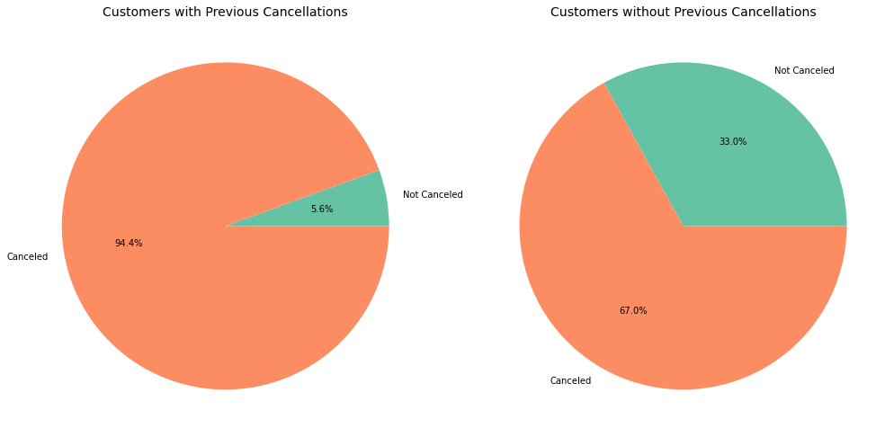
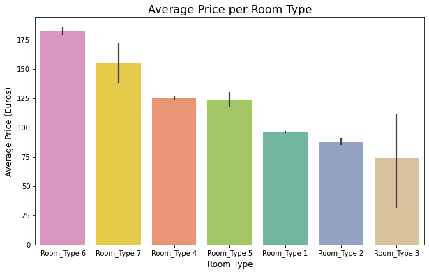
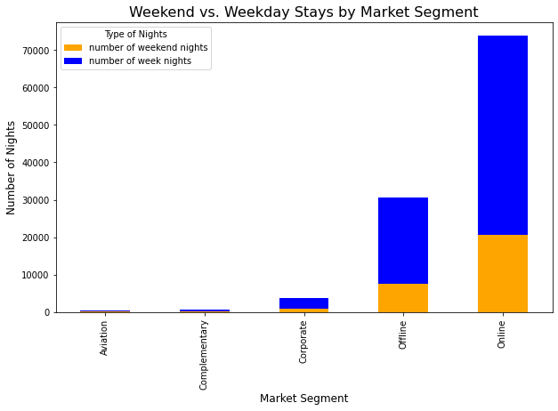

# Data Analysis Project README

## Overview

This repository contains a comprehensive analysis of booking data, focusing on customer behavior, booking trends, and cancellation patterns. Through various visualizations, we aim to provide insights that can help optimize marketing strategies, improve customer experience, and enhance operational planning.

## Table of Contents

- [Data Analysis Project README](#data-analysis-project-readme)
  - [Overview](#overview)
  - [Table of Contents](#table-of-contents)
  - [Project Title](#project-title)
  - [Data Source](#data-source)
  - [Visualizations](#visualizations)
    - [Booking Status Distribution](#booking-status-distribution)
    - [Average Lead Time by Booking Status](#average-lead-time-by-booking-status)
    - [Impact of Special Requests on Booking Cancellations](#impact-of-special-requests-on-booking-cancellations)
    - [Room Type Popularity by Market Segment](#room-type-popularity-by-market-segment)
    - [Relationship Between Previous Cancellations and Current Cancellations](#relationship-between-previous-cancellations-and-current-cancellations)
    - [Average Price vs. Room Type](#average-price-vs-room-type)
    - [Weekend vs. Weekday Stays by Market Segment](#weekend-vs-weekday-stays-by-market-segment)
    - [Car Parking Space Requirement by Market Segment](#car-parking-space-requirement-by-market-segment)
    - [Number of Adults and Children by Booking Status](#number-of-adults-and-children-by-booking-status)
    - [Lead Time and Special Requests by Room Type](#lead-time-and-special-requests-by-room-type)
  - [Conclusion](#conclusion)

## Project Title

Booking Data Analysis

## Data Source

The data used for this analysis comes from [insert source details here, e.g., a CSV file, API, etc.]. It includes various features related to booking status, customer demographics, room types, and special requests.

## Visualizations

### Booking Status Distribution
- **Plot:** Count of bookings that were canceled vs. not canceled.
- **Insight:** Provides an overview of the percentage of cancellations versus successful bookings, aiding in the analysis of customer behavior.

Screenshot

### Average Lead Time by Booking Status
- **Plot:** Average lead time for bookings that were canceled and not canceled.
- **Insight:** Compares how long in advance customers book rooms and how that affects cancellation likelihood.

Screenshot

### Impact of Special Requests on Booking Cancellations
- **Plot:** Relationship between special requests and booking status.
- **Insight:** Assesses whether customers with more special requests are more or less likely to cancel their bookings.

Screenshot

### Room Type Popularity by Market Segment
- **Plot:** Distribution of room types across different market segment types.
- **Insight:** Analyzes which room types are popular among different market segments, providing insights into customer preferences.

Screenshot

### Relationship Between Previous Cancellations and Current Cancellations
- **Plot:** Average number of previous canceled bookings compared with current booking status.
- **Insight:** Examines whether customers with a history of cancellations are more likely to cancel again.

Screenshot

### Average Price vs. Room Type
- **Plot:** Average price per day of reservation across different room types.
- **Insight:** Explores pricing strategies for different room types and their influence on customer choices.

Screenshot

### Weekend vs. Weekday Stays by Market Segment
- **Plot:** Average number of weekend nights and week nights booked across market segments.
- **Insight:** Identifies trends in stay preferences among different market segments.

Screenshot

### Car Parking Space Requirement by Market Segment
- **Plot:** Percentage of bookings requesting a car parking space across market segments.
- **Insight:** Uncovers trends in parking space requirements, useful for operational planning.

Screenshot

### Number of Adults and Children by Booking Status
- **Plot:** Relationship between the number of adults, number of children, and booking status.
- **Insight:** Analyzes if larger groups tend to cancel more or less frequently than smaller groups.

Screenshot

### Lead Time and Special Requests by Room Type
- **Plot:** Cross-analysis of average lead time and special requests for each room type.
- **Insight:** Shows which room types attract more special requests and longer lead times.

Screenshot

## Conclusion

This analysis provides valuable insights into booking behavior, customer preferences, and potential areas for operational improvement. The visualizations created allow for an in-depth understanding of the factors influencing booking cancellations and customer choices.
